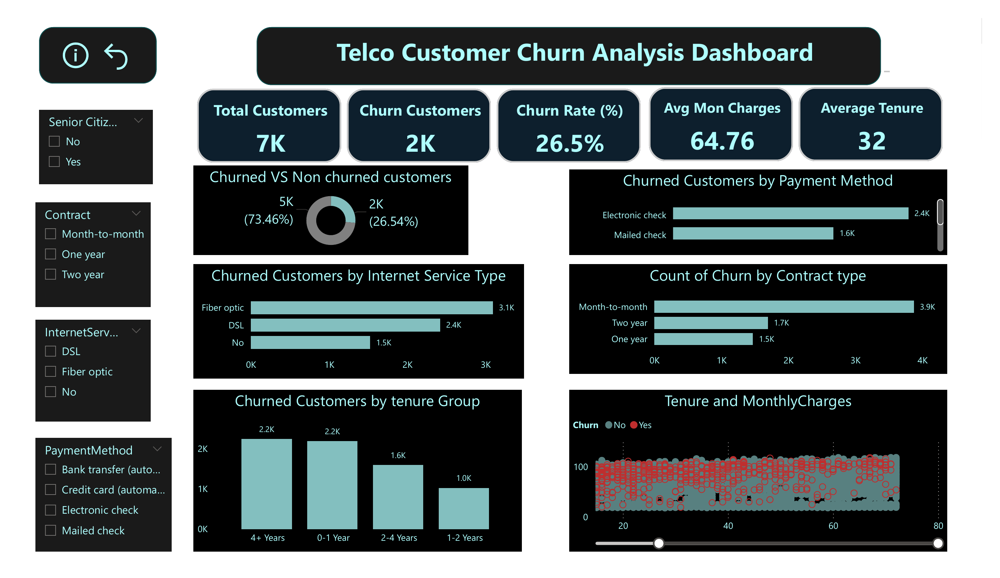

# Telco Customer Churn Analysis

This repository features a Power BI dashboard and a PDF report focused on analyzing customer churn in a telecommunications company. It investigates critical patterns and risk factors linked to customer attrition, enabling businesses to devise more effective retention strategies.

---

## 📘 Introduction

Customer churn is a key metric in the telecommunications industry. By understanding why customers leave, businesses can take proactive steps to improve customer retention and reduce churn rates. This analysis is built on a dataset of 7,000 customers, tracking variables such as contract type, payment method, and service tenure. The Power BI dashboard and complementary PDF report summarize the insights derived from this data.

---

## 🛠️ Background

Telecom companies face high competition, making customer churn a critical issue. Reducing churn means retaining high-value customers and improving service offerings. This analysis is based on a dataset consisting of key customer information, including tenure, payment methods, internet services, and contract types. By analyzing this data, businesses can identify patterns that suggest which customers are most at risk of leaving.

---

## 🧰 Tools Used

- **Power BI** – Interactive dashboard for data visualization
- **Microsoft Excel** – For data preparation and cleaning
- **PDF** – Static format report for distribution and review

---

## 📊 Analysis

### Overview

- **Total Customers:** 7,000  
- **Churned Customers:** 2,000  
- **Churn Rate:** 26.5%  
- **Average Monthly Charges:** $64.76  
- **Average Tenure:** 32 months  

### Churn Breakdown

#### 🔄 Churned vs. Non-Churned
- Churned: 26.5% (2,000 customers)  
- Non-churned: 73.5% (5,000 customers)

#### 📑 Churn by Contract Type
- **Month-to-month:** 3.9K churned  
- **One year:** 1.7K churned  
- **Two year:** 1.5K churned

#### 💳 Churn by Payment Method
- **Electronic check:** 2.4K churned  
- **Mailed check:** 1.6K churned

#### 🌐 Churn by Internet Service Type
- **Fiber optic:** 3.1K churned  
- **DSL:** 2.4K churned  
- **No Internet:** 1.5K churned

#### 📅 Churn by Tenure Group
- **0–1 year:** 2.2K churned  
- **2–4 years:** 1.6K churned  
- **4+ years:** 2.2K churned

#### 💵 Churn vs. Monthly Charges
- Higher monthly charges are associated with higher churn, especially among short-tenure customers.

---

## 📚 Key Learnings

- Month-to-month contracts are strongly linked to high churn rates.
- Electronic payment users, especially via electronic check, are at higher risk.
- Fiber optic service users experience the highest churn among internet types.
- Both very new and long-tenure customers show elevated churn.
- High-paying, short-tenure customers are a critical segment for retention efforts.

---

## 🔍 Strategic Insights

- **Retention programs** should target month-to-month customers and those with high monthly bills.
- **Pricing and loyalty initiatives** could help retain fiber optic and short-tenure customers.
- **Customer experience efforts** should focus on electronic check users to reduce dissatisfaction.

---

## 🏁 Conclusion

This analysis provides data-backed insight into customer churn behavior. The Power BI dashboard and PDF report serve as tools to identify at-risk segments, evaluate churn trends, and support the creation of informed retention strategies.

---

## 📁 Files Included

- [`Churn.pbix`](Churn.pbix) — Power BI interactive dashboard  
- [`Churn.pdf`](Churn.pdf) — Static report version for easy sharing and review

---

## 📷 Dashboard Preview

## 📌 How to Use

1. Install [Power BI Desktop](https://powerbi.microsoft.com/desktop/).
2. Open the `Churn.pbix` file to explore the dashboard interactively.
3. Review `Churn.pdf` for a quick summary or to share with stakeholders.

---

## 📝 License

This project is intended for educational, analytical, and demonstration purposes only.
